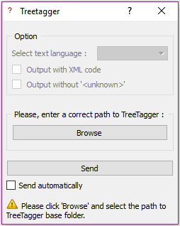
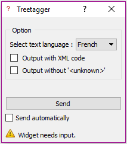
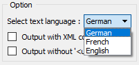

.. meta::
   :description: Orange Textable Prototypes documentation, TreeTagger 
                 widget
   :keywords: Orange, Textable, Prototypes, documentation, TreeTagger,
              widget

.. _TreeTagger:

TreeTagger_Widget
=================

img...

Annote les textes entrant en type et lemma grâce à `Treetagger 
<http://www.cis.uni-muenchen.de/~schmid/tools/TreeTagger/>`_ .

Permet la lemmatisation et l'étiquetage morphosyntaxique d'un texte.

Auteur
------

Xavier Barros

Signals
-------

Inputs: 

   Corpus texte (ex: Text Fiels, Text Files, tec...)

Outputs:

* ``Text data``

  Segmentation contenant le texte rentré annoté (type et lemma)

Déscription
-----------

Ce widget est conçu pour annoté un ou plusieurs textes dans Orange Canvas. 
Le widget fait appel à Treetagger afin d'annoté le contenu entrant.
Il renvoie une seguementation sous format texte ou xml contenant un segment par entrée.
Chaque segment a 3 annotations: un *id*, le *lemma* et le *type*.

L'interface de Treetagger Widget est disponible en deux versions.
La première apparait si le lien vers TreeTagger n'est pas rentré et bloque les fonctionnalité du widget.
La deuxième apparait lorsque le lien est rentré et permet une utilisation normale.

Lien vers Treetagger inconnu
~~~~~~~~~~~~~~~~~~~~~~~~~~~~

   Figure 1: **Treetagger** widget (interface verouillée).

Les **Options** sont vérouillées car le lien vers treetagger n'est pas rentré.

Les **Info** indique à l'utilisateur ce qu'il doit faire pour résoudre le problème.

Il faut aller chercher le lien vers le dossier Treetagger qui doit contenir un certain nombres de fichiers :

* ``cmd/tokenize.pl``
* ``cmd/utf8-tokenize.perl``
* ``bin/tree-tagger``

Le bouton **Send** envoie une segmentation à la sortie. 
Lorsque la checkbox **Send automaticaly** est sélectionné,  
le bouton est désactive et le widget tente d'émettre automatiquement une
sortie à chaque modification de son interface.

Lien vers Treetagger connu
~~~~~~~~~~~~~~~~~~~~~~~~~~

    
    Figure 2: **Treetagger** widget (interface déverouillée).

Les **Options** sont dévérouillées.

Cochez la checkbox **Output with XML code** et résultat sera une sortie avec le texte annoter en XML. 
Cela est utile si votre texte à analyser contient du xml. 

Cocher la checkbox **Output without '<unknow>'** pour ne pas avoir de lemma inconnue. 
Elle prendra la valeur du mot inconnu.

Les **langues** dans l'option apparaitront selon les langues qui seront dans le dossier dossier "Treetagger/lib".

Elle peuvent être télécharger sur le site de `Treetagger 
<http://www.cis.uni-muenchen.de/~schmid/tools/TreeTagger/>`_ même sous "Parameter files"

Le choix de la langue est affiché par ordre alphabétique.

    Figure 3: **Option** du Widget Treetagger (interface déverouillée).

Voici une liste des fichier selon la langue désiré:

+ "French": "french.par", "french-abbreviations"
+ "English": "english-utf8.par", "english-abbreviations"
+ "German": "german-utf8.par", "german-abbreviations"
+ "Italian": "italian-utf8.par", "italian-abbreviations"
+ "Swahili": "swahili.par", "swahili-abbreviations"
+ "Portuguese" : "portuguese.par", "portuguese-abbreviations"
+ "Russian": "russian.par", "russian-abbreviations"
+ "Spanish": "spanish-utf8.par", "spanish-abbreviations", "spanish-mwls"
+ "Slovenian": "slovenian-utf8.par"
+ "Slovak": "slovak2-utf8.par"
+ "Romanian": "romanian.par"
+ "Polish": "polish-utf8.par"
+ "Mongolian": "mongolian.par"
+ "Latin": "latin.par"
+ "Galician": "galician.par"
+ "Finnish": "finnish-utf8.par"
+ "Estonian": "estonian.par"
+ "Bulgarian": "bulgarian-utf8.par"
+ "Spoken French": "spoken-french.par", "french-abbreviations

Messages
--------

Information
~~~~~~~~~~~

*Data correcly sent to output.*
    This confirms that the widget has operated properly.

Warnings
~~~~~~~~

*Settings were changed, please click 'Send' when ready.*
    Settings have changed but the **Send automatically** checkbox
    has not been selected, so the user is prompted to click the **Send**
    button (or equivalently check the box) in order for computation and data
    emission to proceed.
    
*Widget need input.*
    The widget instance is not able to emit data to output because the is no input.

*Treetagger is running...*
   Le widget est en train de tourner, il faut attendre.
   
*Please click 'Browse' and select the path to TreeTagger base folder.*
   Si le lien vers le dossier Treetagger n'est pas rentré.
   
*TreeTagger's link is correct ! Now, Widget needs input.*
   Quand le bon lien est rentré mais qu'il faut encore un input.
    
Errors
~~~~~~

*Sorry, TreeTagger's link isn't correct.*
    Si le lien vers le dossier Treetagger est faux.
    
*Sorry, TreeTagger's link not found.*
    Si le lien vers le dossier Treetagger n'est pas trouvé.
